# GoEmotions Emotion Classification - Results

**Comprehensive results display for the GoEmotions multi-label emotion classification project.**

This document serves as the central hub for all experimental results, visualizations, and analysis. For detailed methodology and design decisions, see [`../reference/design_decisions.md`](../reference/design_decisions.md).

---

## Table of Contents

1. [Quick Summary](#quick-summary)
2. [Dataset Statistics](#dataset-statistics)
3. [Model Performance](#model-performance)
4. [Threshold Analysis](#threshold-analysis)
5. [Calibration Analysis](#calibration-analysis)
6. [Detailed Documentation](#detailed-documentation)

---

## Quick Summary

### Models Trained

| Model | Parameters | Test AUC (micro) | Test F1 (micro) @ 0.5 | Optimal F1 (macro) @ 0.1 | Training Time |
|-------|------------|------------------|----------------------|--------------------------|---------------|
| **RoBERTa-Large** | 355M | **0.9045** | 0.400 | **0.253** | 2.05 hours |
| **DistilBERT** | 66M | 0.8567 | 0.366 | 0.205 | 45 minutes |

**Primary Metric**: AUC (micro) - threshold-agnostic ranking quality
**Winner**: RoBERTa-Large achieves 5.6% higher AUC than DistilBERT

### Key Findings

**Threshold Optimization (RoBERTa-Large):**
- Default 0.5 threshold predicts only 8/28 emotions (F1 macro = 0.133)
- Optimal 0.1 threshold predicts 19/28 emotions (F1 macro = 0.253, 89% improvement)
- Per-class thresholds available for production deployment

**Calibration Quality (RoBERTa-Large):**
- Brier Score: 0.0285 (excellent - close to 0)
- Expected Calibration Error: 0.0094 (very low systematic bias)
- High-confidence predictions (>80%) are highly reliable
- Best calibrated: rare emotions (grief, pride, relief)
- Worst calibrated: neutral (class imbalance effects)

**Performance Highlights:**
- Best emotion: gratitude (F1=0.904, precision=0.974)
- Top performers: amusement (0.724), love (0.740), admiration (0.568)
- Challenging: 9 emotions never predicted reliably even at optimal threshold
- Model is well-calibrated overall - probability estimates are trustworthy

---

## Dataset Statistics

### Class Distribution

<b>Figure 00: Class Distribution (All 28 Emotions)</b>

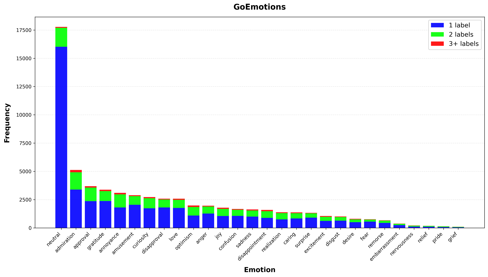

**Key Insights:**
- Highly imbalanced: neutral (17,772) dominates, grief (96) is rarest
- 90.1% of neutral samples are single-label (highest rate)
- Multi-label complexity varies significantly across emotions

<b>Figure 01: Class Distribution (Excluding Neutral)</b>

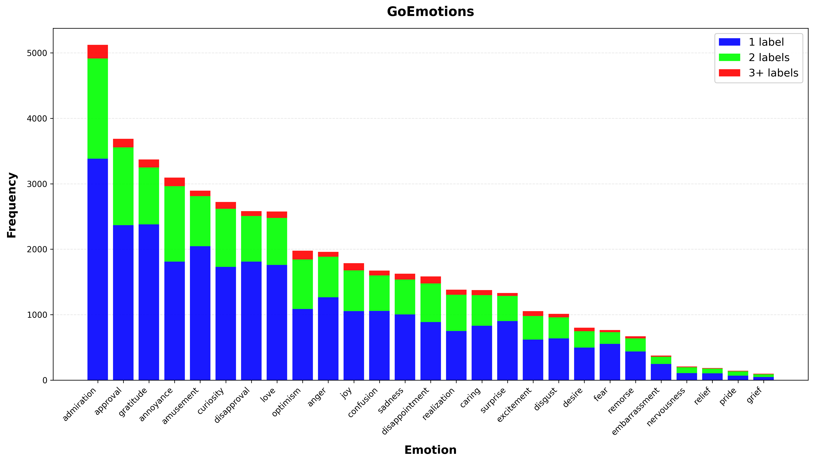

**Key Insights:**
- Admiration (5,122) most common non-neutral emotion
- Clear long-tail distribution: top emotion 53x more common than rarest
- Better visualization of multi-label patterns without neutral's dominance

### Label Co-occurrence

<b>Figure 02-03: Label Co-occurrence Patterns</b>

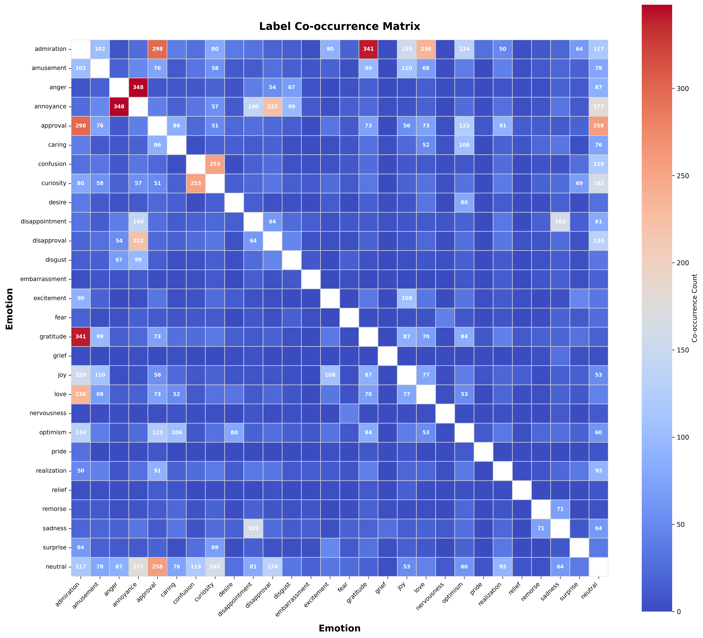
*Full co-occurrence heatmap showing all 28×28 emotion pairs*

*Filtered view showing only significant co-occurrences*

**Key Insights:**
- Strong positive correlations: joy-love, anger-annoyance, sadness-disappointment
- Neutral rarely co-occurs with other emotions (90% single-label)
- Multi-label complexity highest for negative emotions

### Text Length Distributions

<b>Figure 04-05: Character and Token Length Statistics</b>

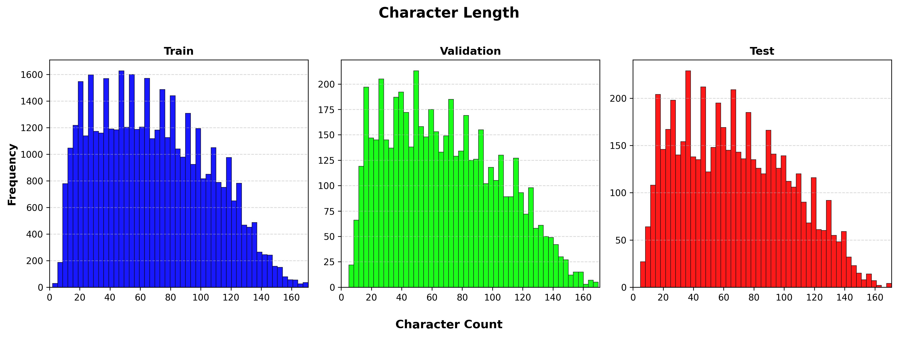
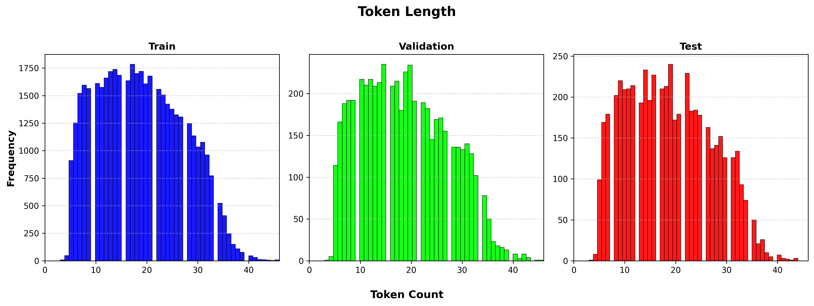

**Key Insights:**
- Mean character length: ~85 characters
- Mean token length: ~18 tokens
- 128 token limit covers ~95% of samples without truncation
- Long-tail: some samples exceed 500 characters

### Metric Relationships

<b>Figure 06-09: Metric Correlations and Trade-offs</b>

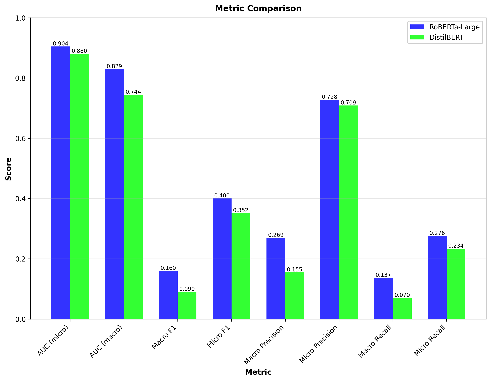
*Correlation matrix showing relationships between evaluation metrics*

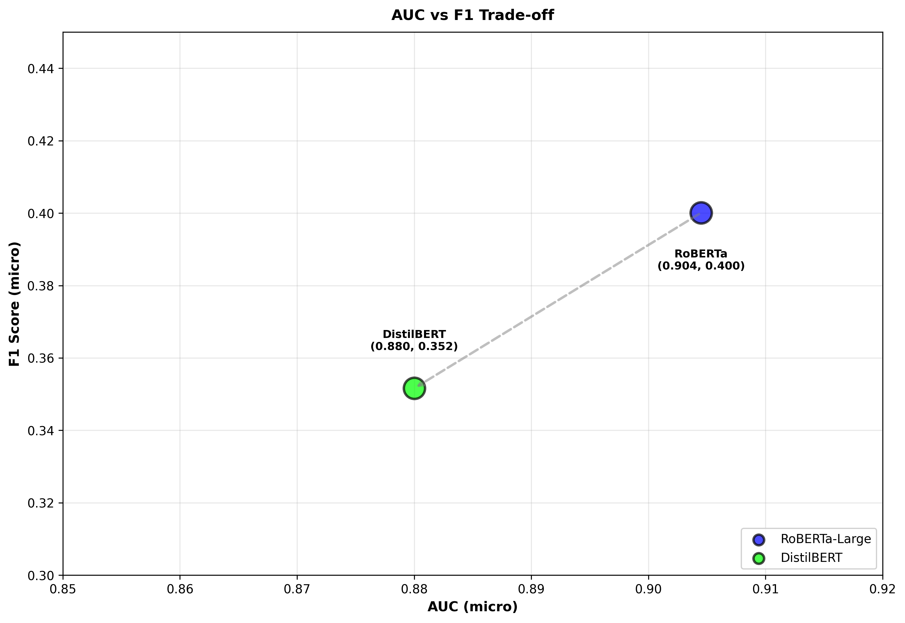
*Trade-off analysis between AUC and F1 scores*

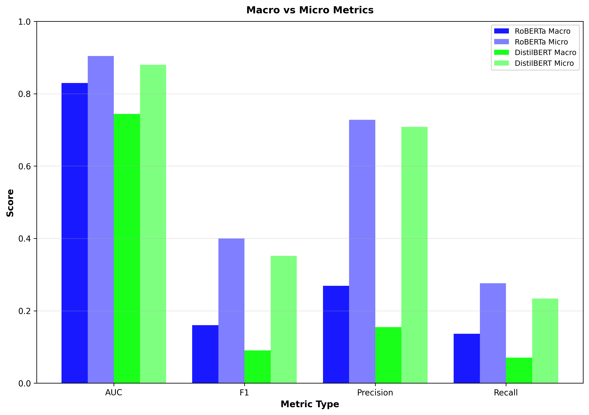
*Comparison of macro-averaged vs micro-averaged metrics*

**Key Insights:**
- Strong correlation between AUC variants (micro/macro)
- Weaker correlation between AUC and F1 (threshold-dependent)
- Macro vs Micro divergence reveals class imbalance effects

---

## Model Performance

### Overall Metrics (RoBERTa-Large)

**Configuration:**
- Model: `roberta-large` (355M parameters)
- Learning Rate: 2e-5 | Batch Size: 16 | Epochs: 10 (best at epoch 1)
- Dropout: 0.1 | Max Sequence Length: 128
- Training Time: 2.05 hours on NVIDIA A100-SXM4-80GB

**Test Set Performance:**
- **Test AUC (micro): 0.9045** ← Primary metric
- **Test AUC (macro): 0.8294** ← Fair treatment of all 28 emotions
- **Micro F1 @ threshold 0.5: 0.4001**
- **Macro F1 @ threshold 0.5: 0.1600**
- **Optimal Macro F1 @ threshold 0.1: 0.2529** (89% improvement)

**See:** [`model_performance.md`](model_performance.md) for complete training details and W&B run links

### Per-Emotion Performance

<b>Figure 10: Per-Emotion F1 Scores (Threshold = 0.5)</b>

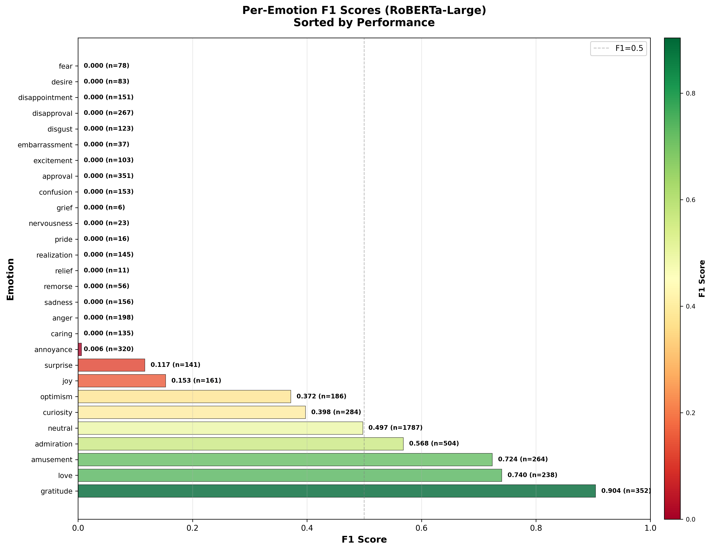

**Visual shows:** All 28 emotions ranked by F1 score with color-coded performance (green=high, yellow=medium, red=low)

#### Complete Emotion Performance Table (Threshold = 0.5)

Sorted by F1 score (highest to lowest):

| Rank | Emotion | F1 Score | Precision | Recall | Support | True Positives |
|------|---------|----------|-----------|--------|---------|----------------|
| 1 | gratitude | 0.904 | 0.974 | 0.844 | 352 | 297 |
| 2 | amusement | 0.724 | 0.808 | 0.655 | 264 | 173 |
| 3 | love | 0.740 | 0.763 | 0.718 | 238 | 171 |
| 4 | admiration | 0.568 | 0.684 | 0.486 | 504 | 245 |
| 5 | neutral | 0.497 | 0.690 | 0.389 | 1,787 | 695 |
| 6 | curiosity | 0.398 | 0.482 | 0.338 | 284 | 96 |
| 7 | optimism | 0.372 | 0.804 | 0.242 | 186 | 45 |
| 8 | joy | 0.153 | 0.636 | 0.087 | 161 | 14 |
| 9 | surprise | 0.117 | 0.692 | 0.064 | 141 | 9 |
| 10 | annoyance | 0.006 | 1.000 | 0.003 | 320 | 1 |
| 11 | anger | 0.000 | 0.000 | 0.000 | 198 | 0 |
| 12 | approval | 0.000 | 0.000 | 0.000 | 351 | 0 |
| 13 | caring | 0.000 | 0.000 | 0.000 | 135 | 0 |
| 14 | confusion | 0.000 | 0.000 | 0.000 | 153 | 0 |
| 15 | desire | 0.000 | 0.000 | 0.000 | 83 | 0 |
| 16 | disappointment | 0.000 | 0.000 | 0.000 | 151 | 0 |
| 17 | disapproval | 0.000 | 0.000 | 0.000 | 267 | 0 |
| 18 | disgust | 0.000 | 0.000 | 0.000 | 123 | 0 |
| 19 | embarrassment | 0.000 | 0.000 | 0.000 | 37 | 0 |
| 20 | excitement | 0.000 | 0.000 | 0.000 | 103 | 0 |
| 21 | fear | 0.000 | 0.000 | 0.000 | 78 | 0 |
| 22 | grief | 0.000 | 0.000 | 0.000 | 6 | 0 |
| 23 | nervousness | 0.000 | 0.000 | 0.000 | 23 | 0 |
| 24 | pride | 0.000 | 0.000 | 0.000 | 16 | 0 |
| 25 | realization | 0.000 | 0.000 | 0.000 | 145 | 0 |
| 26 | relief | 0.000 | 0.000 | 0.000 | 11 | 0 |
| 27 | remorse | 0.000 | 0.000 | 0.000 | 56 | 0 |
| 28 | sadness | 0.000 | 0.000 | 0.000 | 156 | 0 |

**Key Observations:**
- Only 10/28 emotions (36%) have non-zero F1 scores at default 0.5 threshold
- 18 emotions never predicted (0 true positives) - threshold is too conservative
- Top 3 emotions achieve F1 > 0.7 with high precision (>0.76)
- High precision (0.69-0.97) but low recall (0.06-0.84) indicates conservative predictions
- Disapproval has more support (267) than amusement (264) but achieves F1=0.0 vs 0.724 (intrinsically harder)

**Solution:** Threshold optimization dramatically improves coverage (see next section)

---

## Threshold Analysis

### Overview

Default 0.5 threshold is too conservative for multi-label emotion classification with class imbalance. Systematic threshold sweep reveals optimal operating points.

### Threshold Impact Summary

| Threshold | F1 (Macro) | F1 (Micro) | Precision (Macro) | Recall (Macro) | Emotions Predicted |
|-----------|------------|------------|-------------------|----------------|-------------------|
| **0.1** ✓ | **0.253** | **0.491** | 0.240 | 0.307 | **19/28 (68%)** |
| 0.2 | 0.234 | **0.515** | 0.269 | 0.233 | 13/28 (46%) |
| 0.3 | 0.190 | 0.490 | 0.315 | 0.180 | 13/28 (46%) |
| 0.4 | 0.157 | 0.459 | 0.213 | 0.146 | 9/28 (32%) |
| 0.5 (default) | 0.133 | 0.403 | 0.207 | 0.113 | 8/28 (29%) |
| 0.6 | 0.095 | 0.210 | 0.190 | 0.077 | 6/28 (21%) |
| 0.7 | 0.080 | 0.164 | 0.124 | 0.062 | 4/28 (14%) |
| 0.8 | 0.061 | 0.120 | 0.127 | 0.044 | 4/28 (14%) |
| 0.9 | 0.022 | 0.050 | 0.036 | 0.016 | 1/28 (4%) |

**Optimal Threshold:** 0.1 (maximizes macro F1)
**Trade-off:** Lower threshold reduces precision (0.696 → 0.240) but dramatically improves recall and emotion coverage

<b>Figure 11: Macro-Averaged Metrics vs Threshold</b>

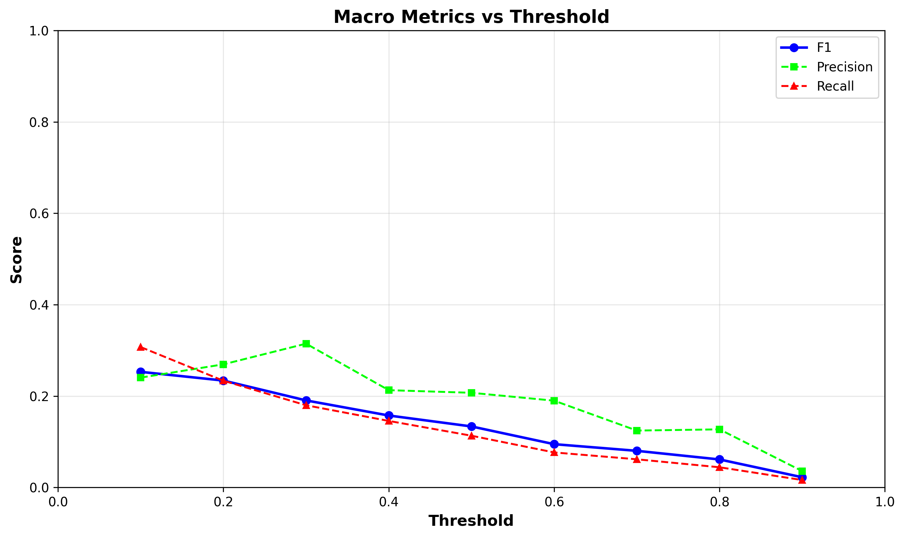

Shows F1, Precision, and Recall (macro-averaged) across threshold values 0.1-0.9.

<b>Figure 12: Micro-Averaged Metrics vs Threshold</b>

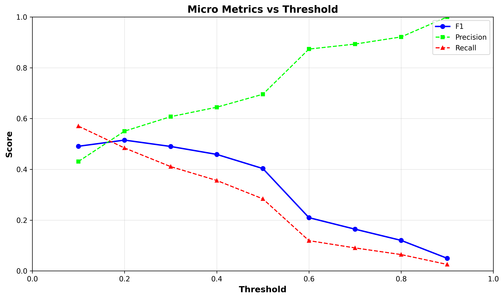

Shows F1, Precision, and Recall (micro-averaged) across threshold values 0.1-0.9.

<b>Figure 13: F1 Score Comparison Across Averaging Methods</b>

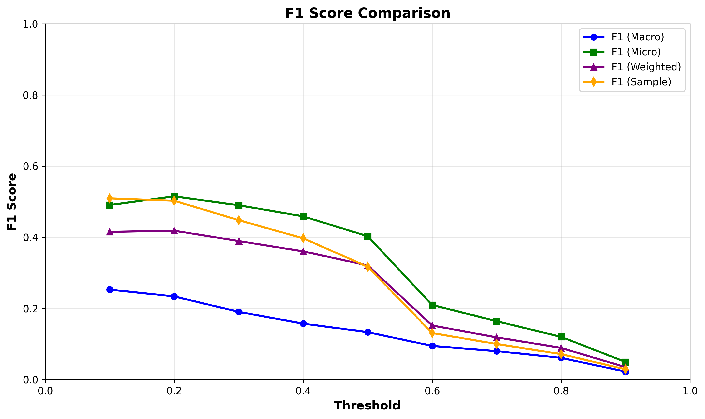

Compares F1 scores computed with macro, micro, weighted, and sample averaging strategies.

<b>Figure 14: Label Coverage vs Threshold</b>

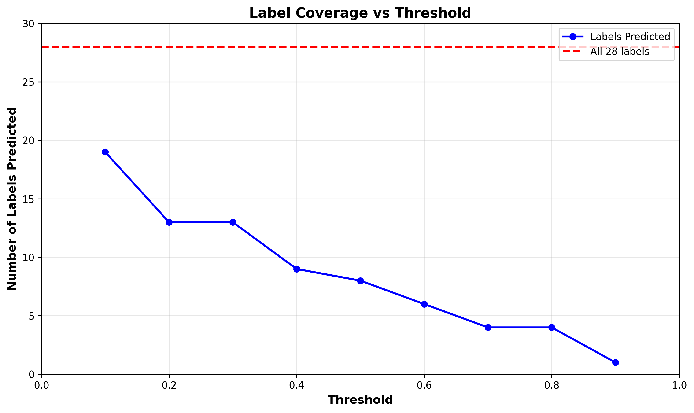

Shows how many of the 28 emotions are actually predicted at each threshold value.

### Per-Class Optimal Thresholds

<b>Figure 15: Per-Emotion Optimal Thresholds</b>

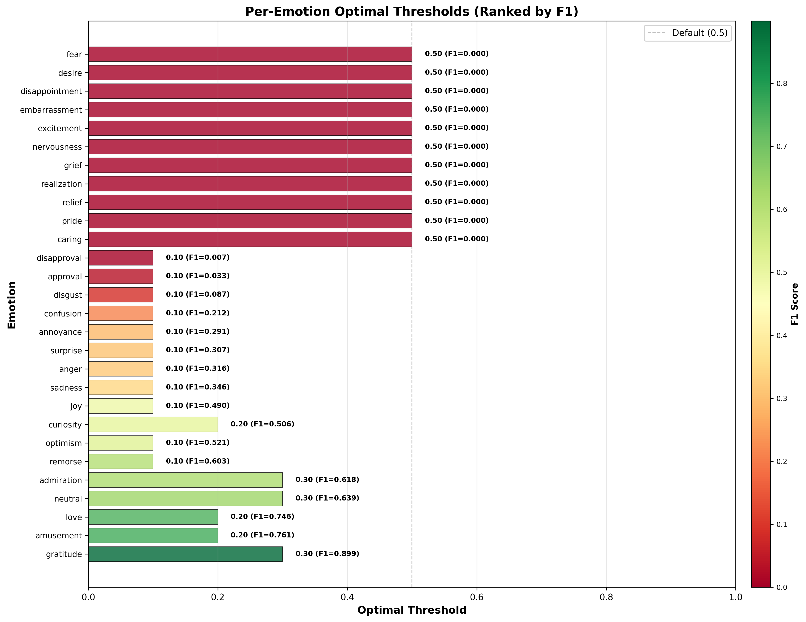

Each emotion's optimal threshold (maximizing F1) with achieved F1 score. Sorted by F1 performance.

**Top 5 Emotions (with optimal thresholds):**
- gratitude: threshold=0.30, F1=0.899
- amusement: threshold=0.20, F1=0.761
- love: threshold=0.20, F1=0.746
- neutral: threshold=0.30, F1=0.639
- admiration: threshold=0.30, F1=0.618

**Challenging Emotions (F1=0 even at optimal threshold):**
- fear, grief, embarrassment, desire, disappointment, pride, relief, nervousness, caring

**Key Insight:** Most emotions perform best at 0.1-0.3 threshold, not the default 0.5.

**See:** `artifacts/stats/threshold_sweep/` for complete threshold sweep data and per-class optimal threshold JSON.

---

## Calibration Analysis

### Overview

Calibration measures whether predicted probabilities match observed frequencies. A well-calibrated model's 70% prediction should be correct ~70% of the time.

**Overall Calibration Quality:**
- **Brier Score: 0.0285** (scale: 0=perfect, 1=worst) ✓ Excellent
- **Expected Calibration Error (ECE): 0.0094** (scale: 0=perfect) ✓ Very low bias

### Calibration by Emotion

| Calibration Rank | Emotion | Brier Score | ECE | F1 Score | Note |
|------------------|---------|-------------|-----|----------|------|
| Best calibrated | grief | 0.0024 | 0.0014 | 0.000 | Correctly predicts low probs |
| 2 | pride | 0.0028 | 0.0015 | 0.000 | Correctly predicts low probs |
| 3 | relief | 0.0033 | 0.0015 | 0.000 | Correctly predicts low probs |
| 4 | nervousness | 0.0039 | 0.0011 | 0.000 | Correctly predicts low probs |
| 5 | embarrassment | 0.0064 | 0.0009 | 0.000 | Correctly predicts low probs |
| ... | ... | ... | ... | ... | ... |
| 24 | disapproval | 0.0503 | 0.0147 | 0.000 | |
| 25 | annoyance | 0.0493 | 0.0179 | 0.006 | |
| 26 | approval | 0.0671 | 0.0202 | 0.000 | |
| 27 | admiration | 0.0493 | 0.0207 | 0.568 | |
| Worst calibrated | neutral | 0.1704 | 0.0506 | 0.497 | Class imbalance effect |

**Paradox:** Best-calibrated emotions have worst F1 scores because model correctly assigns low probabilities to rare/hard emotions.

<b>Figure 17: Reliability Diagrams (Top 6 Emotions by Support)</b>

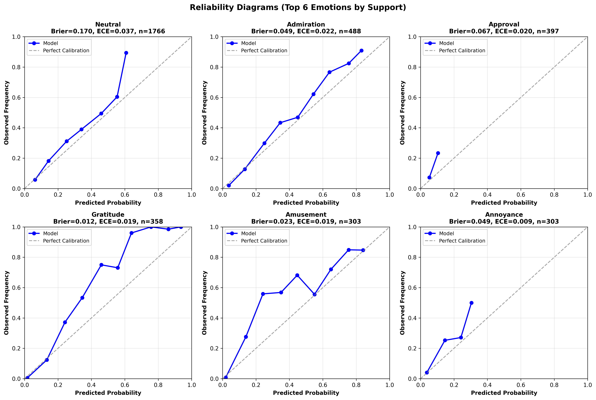

Shows predicted vs observed probabilities for gratitude, neutral, admiration, curiosity, love, and amusement. Points near the diagonal indicate good calibration.

<b>Figure 18: Calibration Summary (All 28 Emotions)</b>

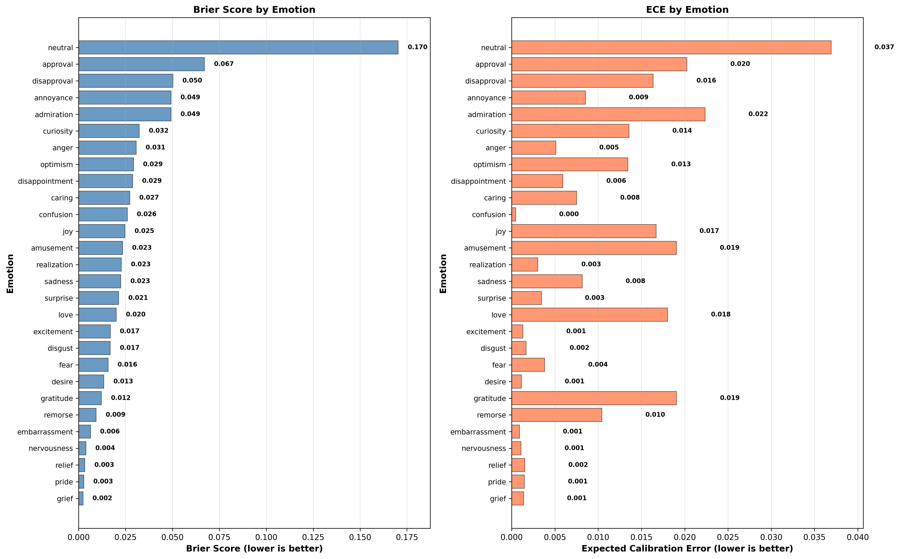

Comparison of Brier scores and ECE across all emotions, sorted by Brier score.

### Practical Implications

**Trust levels for predictions:**
- **High confidence (>80%):** Highly reliable, well-calibrated
- **Mid-range (30-70%):** Slight overconfidence, use caution
- **Low confidence (<10%):** Accurate for rare emotions

**Calibration + Threshold Synergy:**
- Low 0.1 threshold is appropriate given well-calibrated low probabilities
- Model's probability estimates are trustworthy for confidence-based ranking
- Poor-performing emotions are correctly uncertain, not miscalibrated

**See:** `artifacts/stats/calibration/` for complete calibration metrics and `design_decisions.md#model-calibration` for detailed analysis.

---

## Detailed Documentation

### Primary Documentation

- **[`model_performance.md`](model_performance.md)** - Complete model training details, configurations, W&B run links
- **[`../reference/design_decisions.md`](../reference/design_decisions.md)** - Design rationale, threshold selection, calibration interpretation
- **[`../guides/replication.md`](../guides/replication.md)** - How to reproduce all experiments and analysis

### Artifacts and Data

**Model Checkpoints:**
- `artifacts/models/roberta/roberta-large-20251212-211010/` - Best RoBERTa checkpoint
- `artifacts/models/distilbert/distilbert-base-20251212-225748/` - Best DistilBERT checkpoint

**Metrics and Predictions:**
- `artifacts/stats/per_class_metrics_roberta-large_*.csv` - Per-emotion F1/precision/recall
- `artifacts/stats/threshold_sweep/` - Threshold optimization results and figures
- `artifacts/stats/calibration/` - Calibration metrics and reliability diagrams
- `artifacts/predictions/` - Test and validation predictions with probabilities

**Visualizations:**
- `output/figures/` - All 18 figures (00-18, excluding 16 reserved for future)

### Ablation Studies

See [`../../output/ablation_studies/README.md`](../../output/ablation_studies/README.md) for planned systematic experiments including:
- Neutral label inclusion/exclusion
- Loss weighting strategies
- Threshold strategies
- Sequence length impact
- Text robustness tests

---

**Last Updated:** December 2024
**Contact:** ECE-467 Final Project Team

**Next Steps:**
- Run ablation experiments to validate design decisions
- Implement per-class threshold deployment
- Consider temperature scaling for neutral calibration
- Analyze co-occurrence performance patterns
